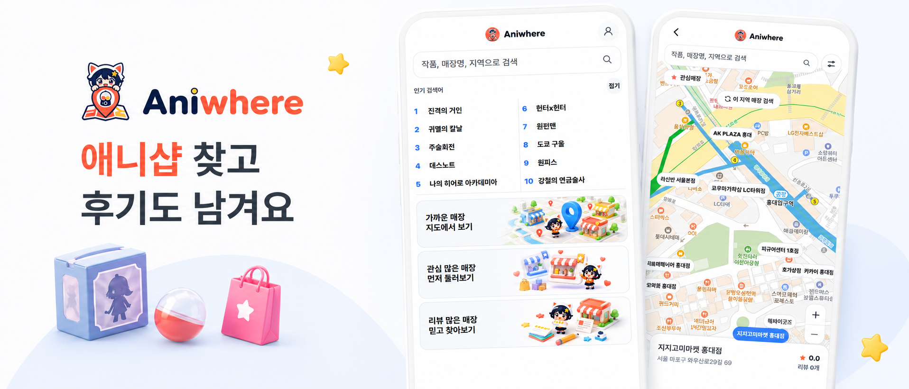
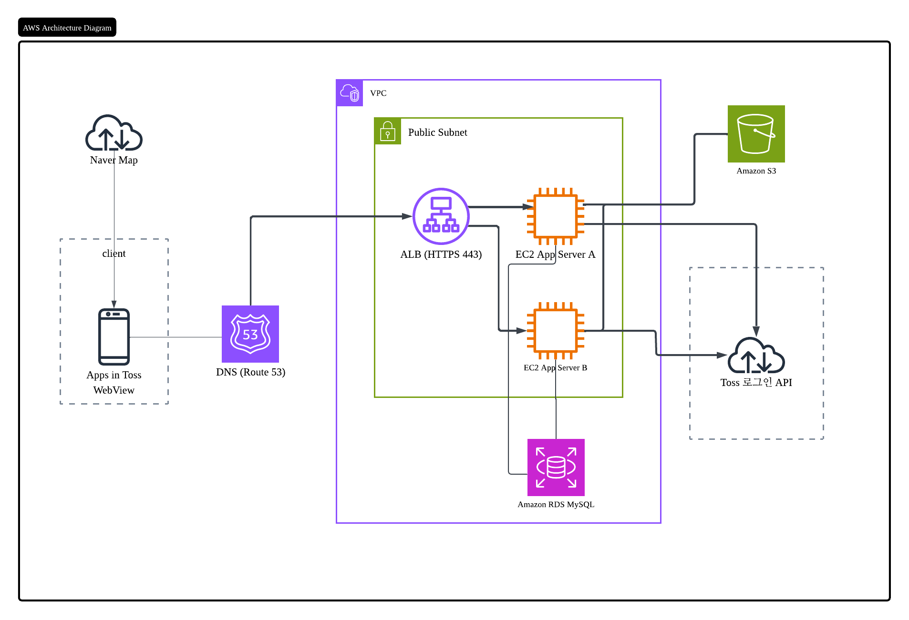

# Aniwhere

**Aniwhere**는 갸챠샵, 피규어샵, 굿즈샵 같은 서브컬처 매장을 찾고, 매장 후기를 남길 수 있는 서비스입니다.

> 애니샵 찾고 후기도 남겨요

## 무엇을 할 수 있나요

- **작품·매장·지역으로 검색** — 관심 있는 애니 작품, 매장 이름, 지역으로 원하는 샵을 찾을 수 있습니다.
- **지도에서 가까운 매장 보기** — 주변 애니샵 위치를 지도에서 확인하고, 매장 정보와 후기를 볼 수 있습니다.
- **인기 매장·리뷰 많은 매장 둘러보기** — 많은 사람이 찾는 매장이나 후기가 쌓인 매장을 먼저 살펴볼 수 있습니다.
- **매장 후기 남기기** — 다녀온 매장의 경험을 공유하고, 다른 팬들의 후기를 참고할 수 있습니다.

## 플랫폼

Aniwhere는 **토스 앱 안에서 실행되는 서비스**(Apps in Toss)입니다. 토스 앱 안에서 바로 애니샵을 찾고 후기를 남길 수 있습니다.

## 시스템 아키텍처

토스 WebView 클라이언트가 `api.aniwhere.link`로 API를 호출하고, AWS `ap-northeast-2` 리전의 VPC에서 요청을 처리합니다.

| 구성 | 역할 |
|------|------|
| Apps in Toss WebView | 사용자 클라이언트 (지도·검색·후기 UI) |
| Route 53 · ALB | DNS 조회 후 HTTPS(`443`)로 EC2에 트래픽 분산 |
| EC2 × 2 | Spring Boot API 서버 (고가용성) |
| RDS MySQL | 매장·후기 등 서비스 데이터 |
| S3 | 이미지 저장 |
| Toss 로그인 API | 서버 측 사용자 인증 |
| Naver Map | 클라이언트 지도 표시 |

**요청 흐름:** WebView → Route 53 → ALB → EC2 → RDS / S3 / Toss 로그인. 지도는 클라이언트에서 Naver Map API를 직접 사용합니다.
